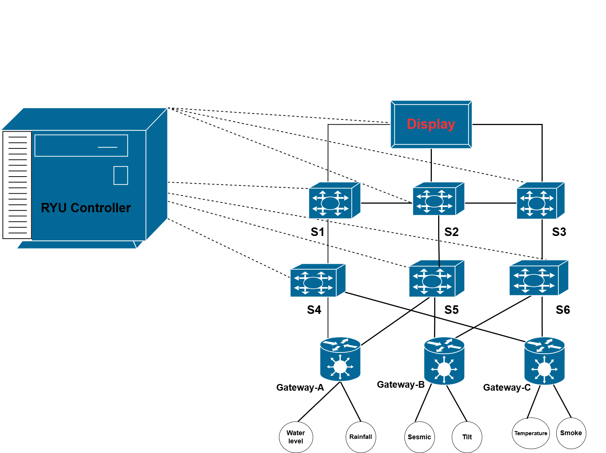
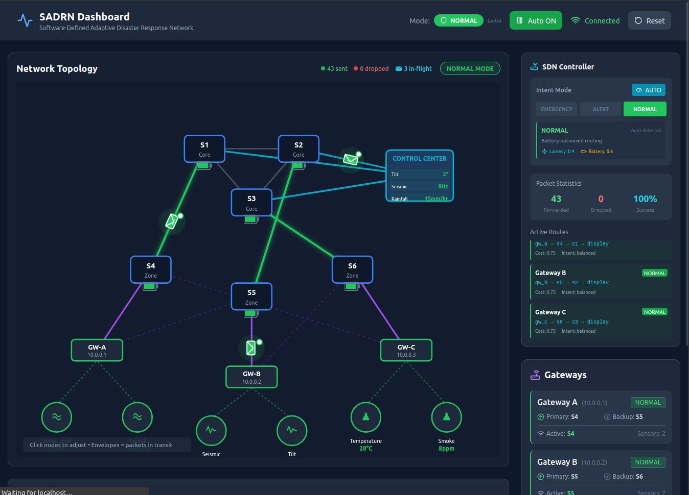

# SADRN — Software-Defined Adaptive Disaster Response Network

<div align="center">



*Real-time disaster monitoring powered by SDN technology*

[](http://mininet.org/)
[](https://ryu-sdn.org/)
[](https://reactjs.org/)
[](https://python.org/)

</div>

---

## 📋 Overview

**SADRN** is a real-time disaster monitoring and response system built on **Software-Defined Networking (SDN)**. It simulates a distributed sensor network across three disaster zones (Flood, Earthquake, Fire), with data flowing through intelligent gateways to a central display server—all visualized through a modern React dashboard.

### Key Features

- 🌐 **6-Switch SDN Topology** — Resilient mesh network with automatic failover
- 📡 **6 Disaster Sensors** — Water level, rainfall, seismic, tilt, temperature, smoke
- 🚨 **Real-time Alerts** — Threshold-based emergency detection and alarms
- 📊 **React Dashboard** — Live visualization of network topology and sensor data
- 🔄 **Dynamic Routing** — Ryu controller with intelligent flow management
- 🔋 **Battery Simulation** — Realistic sensor battery monitoring

---

## 🏗️ System Architecture


```
                           ┌──────────────┐
                           │   Display    │  10.0.0.100
                           │   Server     │  (UDP :9001)
                           └──────┬───────┘
                                  │
                    ┌─────────────┼─────────────┐
                    │             │             │
              ┌─────┴─────┐ ┌─────┴─────┐ ┌─────┴─────┐
              │ S1 Core-1 │ │ S2 Core-2 │ │ S3 Core-3 │
              └─────┬─────┘ └─────┬─────┘ └─────┬─────┘
                    │             │             │
                    └──────┬──────┴──────┬──────┘
                           │  Core Mesh  │
              ┌────────────┼─────────────┼────────────┐
              │            │             │            │
        ┌─────┴─────┐ ┌────┴────┐ ┌──────┴──────┐
        │ S4 Flood  │ │ S5 EQ   │ │ S6 Fire    │
        └─────┬─────┘ └────┬────┘ └──────┬─────┘
              │            │             │
    ┌─────────┼─────┐  ┌───┼───┐   ┌─────┼─────────┐
    │         │     │  │   │   │   │     │         │
  gw_a    water  rain  gw_b seismic tilt  gw_c   temp  smoke
10.0.0.1  10.0.0.11    10.0.0.2 10.0.0.21   10.0.0.3 10.0.0.31
          10.0.0.12           10.0.0.22            10.0.0.32
```

### Disaster Zones

| Zone | Switch | Gateway | Sensors | Monitors |
|------|--------|---------|---------|----------|
| **Flood** | S4 | gw_a (10.0.0.1) | water_a1, rain_a2 | Water level, Rainfall |
| **Earthquake** | S5 | gw_b (10.0.0.2) | seismic_b1, tilt_b2 | Seismic activity, Ground tilt |
| **Fire** | S6 | gw_c (10.0.0.3) | temp_c1, smoke_c2 | Temperature, Smoke density |

---

## 📊 Dashboard Preview



The React dashboard provides:
- **Live Topology View** — Interactive network visualization
- **Sensor Data Panels** — Real-time readings with status indicators
- **Alert System** — Emergency notifications and threshold warnings
- **Battery Monitor** — Sensor battery levels
- **Path Analysis** — Active data flow paths

---

## 🚀 Quick Start

### Prerequisites

| Software | Version | Check Command |
|----------|---------|---------------|
| Mininet | >= 2.3 | `mn --version` |
| Python | >= 3.8 | `python3 --version` |
| Open vSwitch | >= 2.9 | `ovs-vsctl --version` |
| Node.js | >= 16 | `node --version` |
| npm | >= 8 | `npm --version` |
| Ryu SDN | >= 4.34 | `ryu-manager --version` |

### Installation

```bash
# Navigate to SADRN directory
cd ~/SADRN

# Install Python dependencies
pip3 install -r requirements.txt

# Install React dashboard dependencies
cd react-dashboard/frontend && npm install
cd ../backend && pip3 install -r requirements.txt
cd ../..
```

### Start the Complete System

```bash
# Start everything with one command
sudo bash start_sadrn.sh
```

This will:
1. ✅ Clean up any previous instances
2. ✅ Start the **Ryu SDN Controller** (port 6653)
3. ✅ Start the **Dashboard Backend** (port 5000)
4. ✅ Start the **React Frontend** (port 3000)
5. ✅ Start the **Mininet Topology** with all sensors/gateways
6. ✅ Drop you into the Mininet CLI

**Open your browser:** `http://localhost:3000`

---

## 📖 Usage Guide

### Script Commands

| Command | Description |
|---------|-------------|
| `sudo bash start_sadrn.sh` | Start complete system |
| `bash start_sadrn.sh --dashboard` | Start dashboard only (no sudo) |
| `sudo bash start_sadrn.sh --topology` | Start Mininet topology only |
| `bash start_sadrn.sh --controller` | Start SDN controller only |
| `bash start_sadrn.sh --status` | Show status of all components |
| `bash start_sadrn.sh --stop` | Stop all SADRN processes |
| `bash stop_sadrn.sh` | Stop all SADRN processes |

### Mininet CLI Commands

Once in the Mininet CLI (`mininet>`):

```bash
# Test network connectivity
mininet> pingall

# Check specific paths
mininet> gw_a ping -c 3 10.0.0.100     # Gateway to Display
mininet> water_a1 ping -c 3 10.0.0.1   # Sensor to Gateway

# View live sensor data
mininet> sh tail -f /tmp/display.log

# Check switch flows
mininet> sh ovs-ofctl dump-flows s1

# Exit (will cleanup automatically)
mininet> exit
```

### Manual Component Control

Start components individually:

```bash
# Terminal 1: Controller
cd ~/SADRN/controller
ryu-manager --ofp-tcp-listen-port 6653 sadrn_controller.py

# Terminal 2: Dashboard Backend
cd ~/SADRN/react-dashboard/backend
python3 app.py

# Terminal 3: React Frontend
cd ~/SADRN/react-dashboard/frontend
npm run dev

# Terminal 4: Mininet Topology
cd ~/SADRN
sudo python3 topology.py
```

---

## 🧪 Test Cases

### 1. Network Connectivity Test

```bash
mininet> pingall
# Expected: 0% dropped (all hosts reachable)
```

### 2. Sensor-to-Gateway Communication

```bash
# From any sensor, ping its gateway
mininet> water_a1 ping -c 3 10.0.0.1   # Flood sensor → Gateway A
mininet> seismic_b1 ping -c 3 10.0.0.2 # EQ sensor → Gateway B
mininet> temp_c1 ping -c 3 10.0.0.3    # Fire sensor → Gateway C
```

### 3. Gateway-to-Display Communication

```bash
# Each gateway should reach the display server
mininet> gw_a ping -c 3 10.0.0.100
mininet> gw_b ping -c 3 10.0.0.100
mininet> gw_c ping -c 3 10.0.0.100
```

### 4. Cross-Zone Communication

```bash
# Sensors can reach other zones' gateways
mininet> water_a1 ping -c 3 10.0.0.2   # Flood sensor → EQ gateway
mininet> seismic_b1 ping -c 3 10.0.0.3 # EQ sensor → Fire gateway
```

### 5. Data Flow Verification

```bash
# Watch live sensor data at display server
mininet> sh tail -f /tmp/display.log

# Expected output format:
# [11:44:28] gw_a | flood_water  |   8.37 m       | emergency [ALARM]
# [11:44:28] gw_b | eq_seismic   |   3.47 Richter | normal    [OK]
# [11:44:29] gw_c | fire_temp    |  85.88 C       | emergency [ALARM]
```

### 6. API Endpoint Tests

```bash
# Topology data
curl http://localhost:5000/api/topology | python3 -m json.tool

# Sensor readings
curl http://localhost:5000/api/sensors | python3 -m json.tool

# Emergency status
curl http://localhost:5000/api/emergency | python3 -m json.tool

# Battery levels
curl http://localhost:5000/api/battery | python3 -m json.tool
```

### 7. Dashboard Functionality

1. Open `http://localhost:3000` in browser
2. Verify topology visualization loads
3. Check sensor data panels update in real-time
4. Test emergency alert notifications
5. Verify battery level indicators

---

## 🔧 Configuration

### Sensor Thresholds

| Sensor Type | Range | Alert Threshold | Unit |
|-------------|-------|-----------------|------|
| flood_water | 0-10 | >= 7 | metres |
| flood_rain | 0-100 | >= 60 | mm/h |
| eq_seismic | 0-10 | >= 5 | Richter |
| eq_tilt | 0-45 | >= 15 | degrees |
| fire_temp | 0-100 | >= 55 | °C |
| fire_smoke | 0-1000 | >= 300 | ppm |

### Network Ports

| Service | Port | Protocol |
|---------|------|----------|
| Sensor → Gateway | 9000 | UDP |
| Gateway → Display | 9001 | UDP |
| Dashboard Backend | 5000 | HTTP |
| React Frontend | 3000 | HTTP |
| OpenFlow Controller | 6653 | TCP |
| Controller REST | 8080 | HTTP |

### IP Address Map

| Host | IP Address | Role | Zone |
|------|------------|------|------|
| display | 10.0.0.100 | Central Display Server | Core |
| gw_a | 10.0.0.1 | Flood Gateway | Flood |
| gw_b | 10.0.0.2 | Earthquake Gateway | EQ |
| gw_c | 10.0.0.3 | Fire Gateway | Fire |
| water_a1 | 10.0.0.11 | Water Level Sensor | Flood |
| rain_a2 | 10.0.0.12 | Rainfall Sensor | Flood |
| seismic_b1 | 10.0.0.21 | Seismograph | EQ |
| tilt_b2 | 10.0.0.22 | Tilt Sensor | EQ |
| temp_c1 | 10.0.0.31 | Temperature Sensor | Fire |
| smoke_c2 | 10.0.0.32 | Smoke Detector | Fire |

---

## 📁 Project Structure

```
SADRN/
├── start_sadrn.sh              # ★ Main startup script
├── stop_sadrn.sh               # Stop all services
├── topology.py                 # Mininet topology definition
├── requirements.txt            # Python dependencies
│
├── controller/                 # SDN Controller
│   └── sadrn_controller.py     # Ryu OpenFlow controller
│
├── hosts/                      # Network host scripts
│   ├── sensor.py               # Sensor simulation
│   └── gateway.py              # Gateway aggregation
│
├── display/                    # Display server
│   └── display_server.py       # Central UDP receiver
│
├── react-dashboard/            # Web Dashboard
│   ├── backend/                # Flask API server
│   │   ├── app.py
│   │   └── requirements.txt
│   └── frontend/               # React application
│       ├── src/
│       ├── package.json
│       └── vite.config.js
│
└── docs/                       # Documentation
    └── images/                 # Screenshots & diagrams
        ├── architecture.png    # System architecture diagram
        ├── dashboard.png       # Dashboard screenshot
        └── sadrn_banner.png    # Project banner
```

---

## 🔍 Troubleshooting

### Ping Failures (X in pingall)

```bash
# Wait for STP convergence (~15 seconds)
mininet> pingall

# Check if STP is enabled
mininet> sh ovs-vsctl get bridge s1 stp_enable
# Should return: true
```

### Display Not Receiving Data

```bash
# Check if display server is running
mininet> display ps aux | grep display_server

# View display server log
mininet> sh tail -20 /tmp/display.log

# Restart display server
mininet> display pkill -f display_server
mininet> display python3 /home/mininet/SADRN/display/display_server.py 9001 &
```

### Dashboard Not Loading

```bash
# Check backend status
curl http://localhost:5000/api/health

# Check backend log
tail -50 /tmp/dashboard_backend.log

# Check frontend log
tail -50 /tmp/dashboard_frontend.log
```

### Controller Not Connecting

```bash
# Verify controller is running
pgrep -f "ryu-manager"

# Check controller log
tail -50 /tmp/controller.log

# Restart controller
pkill -f "ryu-manager"
cd ~/SADRN/controller
ryu-manager --ofp-tcp-listen-port 6653 sadrn_controller.py &
```

### Port Already in Use

```bash
# Free all SADRN ports
fuser -k 3000/tcp 5000/tcp 5001/tcp 6653/tcp
```

---

## 📊 Log Files

| Log File | Component | Purpose |
|----------|-----------|---------|
| `/tmp/controller.log` | Ryu Controller | OpenFlow events |
| `/tmp/dashboard_backend.log` | Flask API | API requests |
| `/tmp/dashboard_frontend.log` | React/Vite | Frontend build |
| `/tmp/display.log` | Display Server | Sensor data receipts |
| `/tmp/gw_a.log` | Gateway A | Flood zone traffic |
| `/tmp/gw_b.log` | Gateway B | EQ zone traffic |
| `/tmp/gw_c.log` | Gateway C | Fire zone traffic |
| `/tmp/water_a1.log` | Water Sensor | Sensor readings |
| `/tmp/seismic_b1.log` | Seismic Sensor | Sensor readings |
| `/tmp/temp_c1.log` | Temp Sensor | Sensor readings |

---

## 👥 Team

SADRN was developed as part of the 2026 SDN Hackathon.

---

## 📄 License

This project is licensed under the MIT License.

---

<div align="center">

**[⬆ Back to Top](#sadrn--software-defined-adaptive-disaster-response-network)**

</div>
